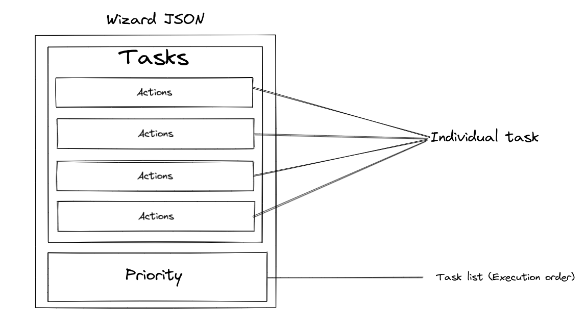

# Wizard

Wizard is Acceldata’s automation engine. `JSON` is used as DSL for the engine. It helps to automate ad-hoc tasks.

---

## Quick links

- [Wizard](#wizard)
  - [Quick links](#quick-links)
  - [Wizard DSL](#wizard-dsl)
    - [JSON Structure for wizard](#json-structure-for-wizard)
    - [Example JSON](#example-json)
    - [Actions](#actions)
    - [Copy Action Vars](#copy-action-vars)
    - [Template Action Vars](#template-action-vars)
    - [File Action Vars](#file-action-vars)
    - [User Action Vars](#user-action-vars)
    - [Cmd Action Vars](#cmd-action-vars)
    - [Systemd Action Vars](#systemd-action-vars)
  - [How to use](#how-to-use)
    - [Task Pkg](#task-pkg)
    - [1. Without logs as a channel](#1-without-logs-as-a-channel)
    - [2. With logs as a channel](#2-with-logs-as-a-channel)
    - [Register Pkg](#register-pkg)
  - [Usage](#usage)

---

## Wizard DSL

Acceldata’s wizard needs users to follow a few rules to construct the JSON file. It needs to follow the below structure -



### JSON Structure for wizard

**Tasks** - All the individual tasks should be defined under this section. Each task should have a list of actions. Each task should have a unique name so that it can be used in the priority list and also can be differentiated logically.

**Priority** - The order of execution of tasks. If this list is empty, then no task will be performed. This is a mandatory field that needs to be filled. The task names should be provided in the list.

**Common Fields** -

- **action** - String, Describes what operation needs to be performed. More about actions in the next section.
- **name** - String, A unique name for the action so that the user can identify or describe the action. This is used in the register Map as a hash if the register field is empty.
- **action_var** - Interface. Each action requires a set of fields and values, these are provided under this field.
- **register** - String, A unique string for storing the action’s output in a Map. This field can be used in when or by the user in the code.
- **when** - Interface, Common for all actions. It can be used in 2 ways. But not together.
  - **cmd and exit code**: provide shell commands and the result exit code. The action will only be performed if the exit code matches.
  - **rvar**: registered action fields should be used here to perform action output comparisons. The operations currently supported by the wizard are - eq (string equals), neq (string not equals), and (logical and), or (logical or)
- **ignore_error** - Boolean, This value is used to ignore any error produced by the action or not. True → ignores the error and moves to the next action. False → Stops all execution and returns an error to the user.
- **timeout** - Integer, used to set the context timeout for when field and the cmd action.

### Example JSON

```json
{
  "tasks": {
    "hydra": [
      {
        "action": "copy",
        "action_var": {
          "src_type": "embed",
          "src": "package/install_libpcap.sh",
          "dest": "/tmp",
          "permission": "0755",
          "owner": "root",
          "group": "root"
        },
        "register": "copy_sh"
      },
      {
        "action": "file",
        "when": {
          "rvar": "copy_sh.changed eq false"
        },
        "action_var": {
          "files": [
            {
              "dest": "/tmp/opt"
            }
          ],
          "dir": true,
          "state": "touch",
          "permission": "0755",
          "owner": "adpulse",
          "group": "adpulse",
          "force": true
        },
        "timeout": 5
      }
    ]
  },
  "priority": ["hydra"]
}
```

### Actions

Below are the actions currently supported by the wizard. More actions will be added in the future -

- **Copy** - Used for copying single or multiple files, and directories.
- **Template** - Used for creating a file from a template file with user-defined values and wizard built-in functions.
- **File** - Used for touching single or multiple files, directories, symlink, and deleting them.
- **User** - Used for creating or deleting a system user.
- **Cmd** - Used for executing shell commands or scripts.
- **Systemd** - Used for systemd-specific operations like start, stop, restart, and reload services.

### Copy Action Vars

| Field      | Type    | Values & Description                                                    |
|------------|---------|-------------------------------------------------------------------------|
| group      | string  | file group from existing groups                                         |
| owner      | string  | file owner from existing users                                          |
| permission | string  | permission for the file                                                 |
| force      | boolean | Replaces the destination file if exists even if the hash is same or not |
| src_type   | string  | local → local FS, embed → embedded in the app binary                    |
| src        | string  | file or dir path                                                        |
| dest       | string  | destination where the files or dir should be copied to                  |
| parents    | boolean | True → creates the destination parent directories                       |
| recursive  | boolean |                                                                         |

### Template Action Vars

| Field      | Type    | Values & Description                                                    |
|------------|---------|-------------------------------------------------------------------------|
| group      | string  | file group from existing groups                                         |
| owner      | string  | file owner from existing users                                          |
| permission | string  | permission for the file                                                 |
| force      | boolean | Replaces the destination file if exists even if the hash is same or not |
| src_type   | string  | local → local FS, embed → embedded in the app binary                    |
| src        | string  | template path                                                           |
| dest       | string  | destination where the template should be copied to                      |
| parents    | boolean | True → creates the destination parent directories                       |

### File Action Vars

| Field      | Type                                        | Values & Description                                                                                                                |
|------------|---------------------------------------------|-------------------------------------------------------------------------------------------------------------------------------------|
| owner      | string                                      | file/dir owner from existing users                                                                                                  |
| permission | string                                      | permission for the file/dir                                                                                                         |
| state      | string                                      | touch → Creates file or dir, link → Creates symlink, absent → Removes file or dir                                                   |
| files      | []interface (check below for the structure) | src and dest both should be provided when the state is set to link, only dest should be provided when the state is touch or absent. |
| dir        | boolean                                     | True → means the dest is a dir                                                                                                      |
| force      | boolean                                     | True → creates and replaces the FILE                                                                                                |

- files structure -

```json
[
  {
    "src": "src_path",
    "dest": "dest_path"
  },
  {
    "src": "src_path2",
    "dest": "dest_path2"
  }
]
```

### User Action Vars

| Field | Type   | Values & Description                                          |
|-------|--------|---------------------------------------------------------------|
| name  | string | name to  create the user with                                 |
| home  | string | user home directory                                           |
| shell | string | user shell                                                    |
| uid   | string | user id to assign for the user                                |
| gid   | string | group id to assign for the user                               |
| state | string | present → will create the user, absent → will remove the user |

### Cmd Action Vars

There are no action vars for cmd action. All the fields and values required for this action are outside the action vars.

| Field       | Type      | Values & Description                                       |
|-------------|-----------|------------------------------------------------------------|
| command     | []strings | Each index of the array should store a part of the command |
| exit_code   | integer   | To match the output/Exit code of the command               |

### Systemd Action Vars

There are no action vars for systemd action. All the fields and values required for this action are outside the action vars.

| Field          | Type    | Values & Description                                                   |
|----------------|---------|------------------------------------------------------------------------|
| name           | string  | systemd service file name                                              |
| state          | string  | accepts → “restart”, “start”, “stop”, “reload” for the systemd service |
| daemon_reload  | boolean | If true then performs a systemd daemon-reload, and then the action     |

---

## How to use

The wizard pkg should be imported into your Go code as a library to perform tasks provided to it using the above-mentioned DSL.

### Task Pkg

The Wizard pkg provides a pkg called task. A new task object should be created and the JSON file should be provided with embedded files if any and a few TemplateOptions. It is done with the `task.New()` function.

```go
import "wizard/task"
```

There are 2 ways to use the wizard:

1. Without logs as a channel
2. With logs as a channel

### 1. Without logs as a channel

- **Function Signature:**

```go
New(config []byte, packageFiles embed.FS, tmplOptions TemplateOptions) (*Task, error)
```

- **TemplateOptions Structure:**

```go
type TemplateOptions struct {
  EnableWizardFacts bool
  TemplateConfig    interface{} // user defined struct for templates
}
```

- **Example:**

```go
wizardTask, err := task.New(agentB, embed.FS{}, task.TemplateOptions{
                            EnableWizardFacts: true,
                            TemplateConfig:    a.sharedConfig.GetVarsData(),
})
```

task.TemplateOptions is used for template action and expects 2 values: `EnableWizardFacts` and `TemplateConfig`. If no values are provided then `TemplateConfig` will be empty and `EnableWizardFacts` will be false. By enabling the `EnableWizardFacts` you can access functions provided by the wizard to use in your template. Template config is the user-defined struct used in the user templates.

`agentB` in the above example code is the user-defined JSON in bytes. The user has to read the JSON and pass it to create a wizard task.

`embed.FS{}` in the above example code is passed because there are no embedded files for the application.

The task.New() function can return an error if any initialization failure occurs in the wizard.

If the Initialization is successful, The user can go ahead with the execution and start performing the actions described in the JSON file using the below method.

- **Task Method:**

```go
(t *Task) Execute() ([]interface{}, error) 
```

The above method performs the tasks in the priority order mentioned in the JSON file and returns an error if the ignore_error field is set to false, it also returns an array of interface which has the wizard logs of wlog type. The user is returned an appropriate error.

- **Example:**

```go
wLog, err := wizardTask.Execute()

// Optional wLog field, can choose to iterate through the logs and print
for _, v := range wLog {
  switch v.(type) {
    case wlog.WLInfo:
      fmt.Println("INFO:", v)
    case wlog.WLError:
      fmt.Println("ERROR:", v)
    case wlog.WLWarn:
      fmt.Println("WARN:", v)
    case wlog.WLDebug:
      fmt.Println("DEBUG:", v)
    default:
      fmt.Println("ERROR:", v)
  }
}
```

### 2. With logs as a channel

- **Function Signature:**

```go
NewWithLog(config []byte, packageFiles embed.FS, tmplOptions TemplateOptions) (*Task, chan interface{}, error)
```

- **TemplateOptions Structure:**

```go
type TemplateOptions struct {
  EnableWizardFacts bool
  TemplateConfig    interface{} // user defined struct for templates
}
```

- **Example:**

```go
wizardTask, wLog, err := task.NewWithLog(agentB, embed.FS{}, task.TemplateOptions{
                            EnableWizardFacts: true,
                            TemplateConfig:    a.sharedConfig.GetVarsData(),
})
```

task.TemplateOptions is used for template action and expects 2 values: `EnableWizardFacts` and `TemplateConfig`. If no values are provided then `TemplateConfig` will be empty and `EnableWizardFacts` will be false. By enabling the `EnableWizardFacts` you can access functions provided by the wizard to use in your template. Template config is the user-defined struct used in the user templates.

`agentB` in the above example code is the user-defined JSON in bytes. The user has to read the JSON and pass it to create a wizard task.

`embed.FS{}` in the above example code is passed because there are no embedded files for the application.

The task.New() function can return an error if any initialization failure occurs in the wizard.

If the Initialization is successful, The user can go ahead with the execution and start performing the actions described in the JSON file using the below method.

- **Task Method:**

```go
(t *Task) Perform(logCh chan interface{}) error
```

The above method performs the tasks in the priority order mentioned in the JSON file and returns an error if the ignore_error field is set to false. This function should be ran in a go routine since the the log chan is being passed as a function parameter.

- **Example:**

```go
go func(){
    err := wizardTask.Perform(wLog)
}{}

// Optional wLog field, can choose to iterate through the logs and print
for _, v := range wLog {
  switch v.(type) {
    case wlog.WLInfo:
      fmt.Println("INFO:", v)
    case wlog.WLError:
      fmt.Println("ERROR:", v)
    case wlog.WLWarn:
      fmt.Println("WARN:", v)
    case wlog.WLDebug:
      fmt.Println("DEBUG:", v)
    default:
      fmt.Println("ERROR:", v)
  }
}
```

### Register Pkg

Every action’s output is registered by the wizard. It is stored in a map. The key for each action should be unique which is either provided by the user in the JSON or created using the name field by the wizard.

- **Register Map -**

```go
var RMap = make(map[string]*Register)
```

- **Register Struct -**

```go
type Register struct {
  Changed  bool
  StdOut   string
  StdErr   string
  ExitCode int
}
```

The user can use the RMap after the tasks are executed for his business logic. Users can use the below register function to get the register value for the action if the register field was not provided to it.

```go
GetHash(actionName string) string
```

- **Examples:**

```go
actionResult := register.RMap["copy_action_register_value"]
// or 
actionResult := register.RMap[register.GetHash("action_name")]
```

---

## Usage

Look into the `example` directory

---
